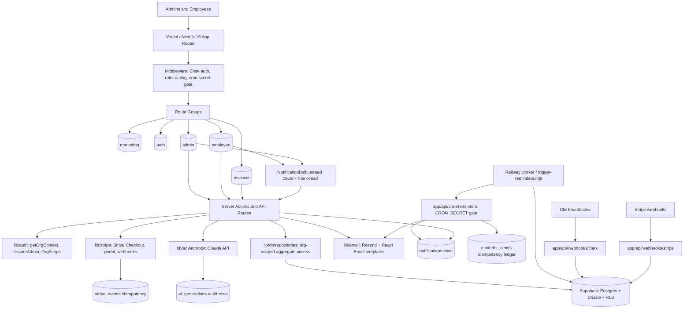

# Consultant System Map — PolicyPilot

Updated: 2026-06-16 - HEAD-pin `7ba6ba2` (`main`). **Phase 8 Validation (CSV-first slice, AC#5) SHIPPED to `main` via PR #48 squash commit `03c18d4` (2026-06-16) — 8th/FINAL phase; v1.0 build COMPLETE.** New surface on `main`: `GET /api/reports/acknowledgments?format=json|csv` (admin-gated; org-scoped ack report query in `lib/db/repositories/reports.ts` with MIN(assignedAt)+GROUP BY dedup, `org_id`+RLS on every join; hand-rolled formula-guarded CSV serializer — no new dep). The reporting/CSV leg of workflow #5 is now real, not aspirational. Prior: 2026-06-15 - Phase 7 (Crons + Email) SHIPPED to `main` via PR #44 squash commit `8b7019d` (2026-06-14) — 7th of 8 phases; branch `gsd/phase-7-crons-email` deleted post-merge; main `3df5223`. The hosted-CI red was environmental and is RESOLVED (merged with gates green). Shipped surface: `lib/email/*` (Resend + React Email, 4 templates + base layout), `GET /api/cron/reminders` (in-route CRON_SECRET gate, idempotent via `reminder_sends`), Railway worker (`worker/trigger-reminders.mjs` + `railway.json`), `reminder_sends` send-ledger (additive `0014`, dev/TEST only — staging/prod operator-gated), in-app NotificationBell, and publish/assign/update event emission. Prior: 2026-06-14 - Phase 7 published as draft PR #44 from `gsd/phase-7-crons-email` (tip `9a3ebe2`); `verify:phase-7` green (tsc 0 / 39 vitest files·332 tests / check:rls / db:verify); ship-review `wf_0fa4b84e-ad3` = ship / 0 must-fix + 4 follow-ups (FU-2 folded `6fd033a`, FU-4 folded `aa6d8ab`, FU-1 false-positive, FU-3 hosted CI red = environmental); NOT merged. Prior: 2026-06-05 - Phase 9 Reviewer MVP shipped via PR #42 at `1122da5` (D-09-01): `(reviewer)` route group + `review_decisions` append-only audit ledger + `publish()` Growth+ approval-completeness gate (R-017 mitigated live)

## Product Boundary

PolicyPilot is an AI-powered policy and procedure management SaaS for SMBs. It replaces ad hoc Google Drive / SharePoint policy folders with policy drafting, lifecycle management, employee acknowledgments, employee Q&A, billing, reminders, reporting, and audit trails.

The core promise only holds if these three capabilities remain true:

1. AI is in the MVP: draft generation, summaries, Q&A, and consistency checks.
2. The acknowledgment trail is append-only and auditor-trustworthy.
3. Tenant isolation is enforced in both the application layer and database RLS.

---

## Runtime Architecture



---

## Trust Boundaries

| Boundary | Rule | Failure Impact |
|---|---|---|
| Browser → server | Never trust client state for role, org, subscription, or acknowledgment status. | Cross-org leak, privilege escalation, or audit corruption. |
| Server → database | Every tenant query must include `org_id`; RLS must also enforce isolation. | Tenant data breach; product failure. |
| Webhooks → app | Verify signatures and make handlers idempotent. | Spoofed provisioning/billing changes or duplicate side effects. |
| App → Claude | Claude calls are server-only, tier-gated, and logged. | Secret exposure, runaway cost, or missing audit data. |
| Cron → app/data | Cron routes require `CRON_SECRET`; reminder sends must be idempotent. | Spam, duplicate notices, or unauthorized batch work. |
| Migrations → deploy | Apply and verify migrations before deploying code that depends on them. | Runtime 503s or schema drift. |

---

## Current Phase Map

```text
Phase 1 Foundation      shipped
Phase 2 Data Layer      shipped
Phase 3 Admin UI        shipped
Phase 4 AI Layer        shipped
Phase 5 Employee Portal shipped
Phase 6 Billing         shipped (PR #32 squash commit 243067e; 06-01 foundation + 06-02 webhook + 06-03 tier gates + 06-04 checkout/pricing + 06-05 Customer Portal/settings + 06-06 verifier complete; db:verify green; local UAT 11/11 PASS; hosted pre-merge checks green/acceptable at 1abca44; post-merge targeted checks PASS)
Phase 7 Crons + Email   shipped (PR #44 squash commit 8b7019d, 2026-06-14; branch gsd/phase-7-crons-email deleted post-merge; main now 3df5223) — Railway worker → GET /api/cron/reminders (CRON_SECRET gate) → 4 Resend/React-Email types + notifications rows, deduped by additive reminder_sends ledger (migration 0014, dev/TEST only; staging/prod operator-gated); in-app NotificationBell (unread + mark-all-read); next_review_date-on-publish + policy_assigned/policy_updated event emission; verify:phase-7 green (tsc 0 / 39 vitest files·332 tests / check:rls / db:verify pass); ship-review wf_0fa4b84e-ad3 = ship / 0 must-fix + 4 follow-ups (FU-2 folded 6fd033a, FU-4 folded aa6d8ab, FU-1 false-positive, FU-3 hosted-CI red environmental and RESOLVED — merged with gates green)
Phase 8 Validation      shipped (PR #48 squash commit 03c18d4, 2026-06-16; 8th/FINAL phase — v1.0 build COMPLETE) — GET /api/reports/acknowledgments?format=json|csv + org-scoped ack report query (lib/db/repositories/reports.ts, MIN(assignedAt)+GROUP BY dedup, org_id+RLS on every join) + hand-rolled formula-guarded CSV serializer (leading-whitespace + null/number safe); verify:phase-8 green (per-run ephemeral postgres:16 digest-pinned containers); ship-review wf_f53707fe-2a9 = GO / 0 critical / 0 important. DEFERRED: dashboard donut/recharts (ASK-FIRST + ≥14d), Stripe test-clock AC#6, beat-manual benchmark SC#5, seed harness
Phase 9 Reviewer        shipped / monitor (PR #42 @ 1122da5, D-09-01) — out-of-band feature closing R-017: (reviewer) route group + review_decisions append-only ledger + publish() Growth+ approval-completeness gate
```

Phase 5 shipped via PR #27 at `3344847`. Phase 6 shipped via PR #32 at squash commit `243067e9f259561a595230e5e7d3e97634040157` after prior PR head `1abca44dff89ccc7151d59b07fe1a93ce3d7be81` passed the hosted pre-merge gate. Plans 06-01 through 06-06 are complete: catalog/client/mask helpers exist, the additive billing-state migration is applied to the approved TEST/dev Supabase target, the Stripe webhook route verifies raw bodies, handles the 5 locked events, re-fetches canonical subscriptions where required, writes idempotently, `maxUsers` uses a real org-scoped user count, the admin checkout Server Action creates Stripe Checkout Sessions from server-derived org/price/metadata, public pricing carries only non-authoritative tier/interval intent, `/settings` is admin-gated, the admin billing page opens Stripe Customer Portal sessions from the DB-stored customer ID only, and `verify:phase-6` plus the hosted workflow/UAT checklist are wired. Local `pnpm db:verify`, pre-merge `pnpm verify:phase-6`, Stripe test-mode UAT rows 1-11, hosted pre-merge PR #32 checks, and post-merge targeted checks are green/acceptable. Hosted CI mutates only the approved dev/test Supabase target through TRUNCATE/seed; staging/prod remain operator-gated.

Post-ship topology note: `gsd/phase-6-billing` contained local docs/topology work after the PR branch was published. The product/security scoped diff between that branch and `gsd/phase-6-stripe-uat-complete` was checked empty on 2026-05-31 before carrying over only safe docs. The remote PR branch was deleted by merge, and local `gsd/phase-6-billing` has since been deleted (no longer divergent).

Phase 7 Crons + Email is SHIPPED to `main` via PR #44 squash commit `8b7019d` (2026-06-14; branch `gsd/phase-7-crons-email` deleted post-merge; main has since advanced to `3df5223` via the STATE reconcile `745cb0d` → PR #47 billing fail-closed `f4b4815` → PR #32-triage docs `6a90196`/`3df5223`). Plans 07-01..07-08 are complete: `lib/email/` (lazy `getResendClient` singleton, typed `type → {subject, template}` dispatch map, masked recipient logging, base layout + one React Email template per type), `GET /api/cron/reminders` (self-gates on `Bearer {CRON_SECRET}` since middleware bypasses Clerk for `/api/cron/*`; loops orgs under `withOrgScope`; record-then-send idempotency via the additive `reminder_sends` natural-key ledger committed before Resend send; returns `{reviewReminders, ackReminders}`), the Railway worker (`worker/trigger-reminders.mjs` + `railway.json`, dependency-free HTTPS GET on the 08:00 UTC schedule per ADR-014), the `next_review_date`-on-publish writer plus the `policy_updated` event emission in `lib/policies/transitions.ts` (the `policy_assigned` email+notification is emitted from the admin bulk-assign action in `app/(admin)/policies/[id]/actions.ts`), and the in-app NotificationBell (`Notifications.create()`/`markRead()` implemented; `markAllReadForUser` server action; admin + employee mount points). `reminder_sends` is additive forward migration `0014` (operator-pre-approved authoring), applied to dev/TEST only this phase; staging/prod remain operator-gated. `verify:phase-7` is green (`tsc --noEmit` 0, 39 vitest files / 332 tests, `check:rls` pass, `db:verify` pass — the dev Supabase project was resumed). It first went green at `5d304b4` after a flake fix (the earlier full-suite RED was a CPU-starvation flake against Vitest's 5s default `testTimeout`, fixed by raising the shared `vitest.config` `testTimeout`/`hookTimeout` to 30s — load tolerance only, the gate was NOT weakened), and re-verified green at `aa6d8ab` after folding two follow-ups. Ship-review `wf_0fa4b84e-ad3` returned ship / 0 must-fix + 4 follow-ups: FU-2 folded at `6fd033a` (vitest default env `node`; jsdom scoped to `**/*.test.tsx` via `environmentMatchGlobs`), FU-4 folded at `aa6d8ab` (completed the `@/lib/db/schema` mock in `transitions.test.ts` + contained the `RESEND_FROM_EMAIL` env leak in `send.test.ts` via `vi.stubEnv`/`vi.unstubAllEnvs`), FU-1 was a confirmed false positive (no commit), and FU-3 = the hosted CI red (now resolved). The hosted-CI red was ENVIRONMENTAL, not a Phase 7 defect, and is RESOLVED: PR #44 squash-merged to `main` at `8b7019d` (2026-06-14) with gates green — the lone en-route Phase 6 verifier red was the known transient TRUNCATE-deadlock flake (cleared by re-run), not a CI-secret blocker. The live 08:00 UTC Railway run is operator-executed secret-safe evidence, not a CI gate (ADR-014); the staging/prod migration of `0014_reminder_sends` remains operator-gated; no deploy, no live email send, no live Stripe.

---

## Primary User Workflows

### 1. Admin policy authoring

1. Admin signs in via Clerk.
2. Middleware gates admin routes.
3. `getOrgContext()` resolves Clerk org/user into internal org/user records.
4. Admin creates or edits policy in TipTap.
5. Server action writes through org-scoped repositories.
6. State-machine rules enforce Draft → Under Review → Published → Archived transitions.
7. Publish-time summary may call Claude Haiku and cache TL;DR on the policy.

### 2. AI-assisted policy work

1. Admin requests draft, summary, Q&A, or consistency check.
2. API route authenticates and scopes org.
3. Tier and role checks run before Claude call.
4. Claude request is server-only.
5. Successful calls write `ai_generations` rows.
6. Q&A answers only from published org policies and returns citations.
7. Consistency check uses Batch API and stores async job state.

### 3. Employee acknowledgment

1. Employee signs in via Clerk.
2. Employee route loads assigned policies for their org/user.
3. Employee reads policy and acknowledges current version.
4. Acknowledgment row is inserted; prior acknowledgments are never modified or deleted.
5. Admin/reporting surfaces acknowledgment status.

### 4. Billing and tier enforcement

1. Admin chooses plan through public pricing intent or the admin billing surface.
2. Authenticated admin checkout creation uses server-derived org context, catalog price lookup, and Stripe Checkout.
3. Stripe webhooks update server-side subscription state.
4. API routes and Server Components read subscription state from DB.
5. Feature gates return 403 or redirect to upgrade when plan is insufficient.
6. Linked admins manage payment/subscription details through Stripe Customer Portal from `/settings`.
7. Stripe events are stored idempotently.

### 5. Reminder and reporting loop

1. Railway worker identifies due/unacknowledged assignments.
2. Reminder send is checked for idempotency.
3. Resend sends transactional emails.
4. Reporting dashboard and CSV export expose audit evidence.

### 6. Reviewer approval (Phase 9 — R-017 / D-09-01)

1. Reviewer or admin signs in via Clerk; middleware routes reviewers to `/reviewer`.
2. The shared org review queue lists every PENDING `workflow_stages` row (`listPendingForOrg`) — the MVP is a shared queue, not per-reviewer assignment.
3. Reviewer opens a policy (read-only `PolicyView`) and Approves or Rejects.
4. `recordReviewDecision` runs in ONE transaction: mutates the `workflow_stages` projection (bound to org + policy + a pending stage), appends an immutable `review_decisions` ledger row (the actual approver), and on Reject returns the policy to draft.
5. For Growth+ orgs, `publish()` enforces an approval-completeness gate (must be `under_review` + ≥1 approved + 0 pending) — covering `approve()`, closing the publish-leak. Starter stays direct-publish.
6. `review_decisions` is append-only (no update/delete), enforced by the immutability gate + RLS org-isolation; `submitForReview` supersedes any stale pending stage so the gate can never wedge.

---

## Hotspots for Future Consultants

- `middleware.ts`: auth, role routing, webhook exemptions, cron gate.
- `lib/auth/context.ts`: Clerk-to-internal context resolution.
- `lib/db/scoped.ts`: transaction, JWT claim injection, RLS enforcement.
- `lib/db/index.ts`: lazy Proxy barrel — side-effect-free import; resolves the Postgres client + `DATABASE_URL` check on first runtime access (Cause-B build-crash fix; keeps `next build` from evaluating a connecting module).
- `lib/db/repositories/*`: app-layer org scoping.
- `app/api/ai/*`: AI route security, logging, tier gates.
- `app/api/webhooks/*`: signature verification and idempotency.
- `app/api/cron/reminders/route.ts`: self-gates on `Bearer {CRON_SECRET}` (middleware bypasses Clerk for `/api/cron/*`), loops orgs under `withOrgScope`, record-then-send idempotency; returns `{reviewReminders, ackReminders}`. Phase 7.
- `app/api/reports/acknowledgments/route.ts` + `lib/db/repositories/reports.ts`: admin-gated acknowledgment report — `?format=json|csv`; org-scoped query with `org_id`+RLS on every join, MIN(assignedAt)+GROUP BY dedup (one row per user/policy), and a hand-rolled formula-guarded CSV serializer (leading-`=`/`+`/`-`/`@` neutralized past leading whitespace; null/number cells coerced safely). Auth errors map to status in-route. Phase 8 (AC#5). No new dependency.
- `lib/email/*` (`client.ts` lazy `getResendClient`, `send.ts` typed dispatch + masked logging, `errors.ts`, `recipients.ts`, `urls.ts`, `templates/*`): the Resend + React Email transport for all 4 notification types. Phase 7 (ADR-016).
- `drizzle/0014_reminder_sends.sql` (natural-key UNIQUE on `(org_id,user_id,policy_id,type,window_date)`) + `lib/db/repositories/reminders.ts` (org-scoped review_due / ack_reminder candidate queries): the at-most-once send-ledger. The `onConflictDoNothing` claim-before-send INSERT lives in `app/api/cron/reminders/route.ts` (record-then-send) — the idempotency invariant for the cron. Phase 7.
- `worker/trigger-reminders.mjs` + `railway.json`: the dependency-free Railway worker that HTTPS-GETs the cron at 08:00 UTC with `CRON_SECRET`. Phase 7 (ADR-014).
- `components/notifications/{NotificationBell,NotificationBellServer}.tsx` + `notification-href.ts` + `app/(employee)/notifications/actions.ts` (`markAllReadForUser`): the in-app bell (unread count + mark-read); `Notifications.create()`/`markRead()` now implemented (`notifications` is intentionally mutable, NOT in `IMMUTABLE_TABLES`). Phase 7.
- `lib/policies/transitions.ts`: now also writes `next_review_date` on publish and emits the `policy_updated` event (the `policy_assigned` event is emitted from the admin bulk-assign action in `app/(admin)/policies/[id]/actions.ts`); both feed reminders + notifications. Phase 7.
- `drizzle/*`: migration source of truth.
- `scripts/check-*`: executable project invariants.
- `app/(reviewer)/*` + `lib/policies/transitions.ts` (`publish()` approval-completeness gate, `recordReviewDecision`) + `lib/db/repositories/{workflow_stages,review_decisions}.ts`: the Phase 9 reviewer/approval surface; `review_decisions` is an append-only audit ledger (R-017 / D-09-01).

---

## Keep-Current Rule

Update this map whenever routes, data stores, external services, trust boundaries, cron flows, billing flows, or AI surfaces change. If a change does not affect the map, record `system_map: no-change` in the delta report.
