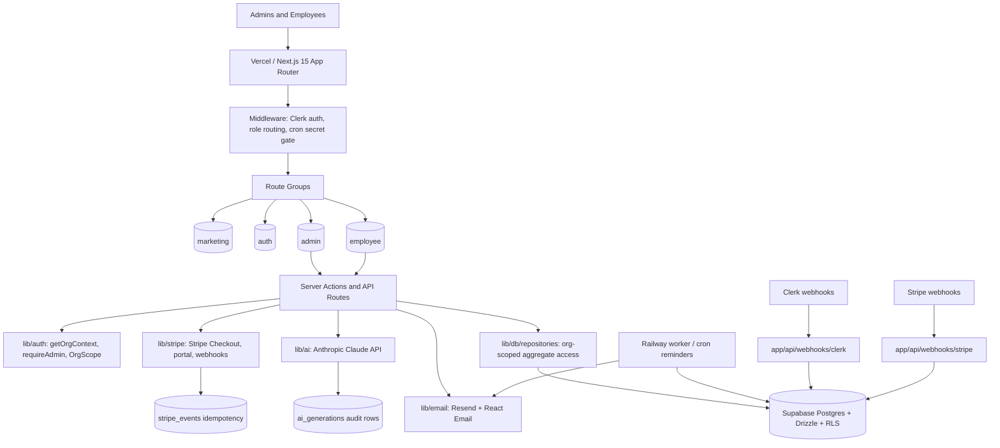

# Consultant System Map — PolicyPilot

Updated: 2026-05-31 - Phase 6 UAT complete; draft PR #32 ship-prep; branch topology reconciled

## Product Boundary

PolicyPilot is an AI-powered policy and procedure management SaaS for SMBs. It replaces ad hoc Google Drive / SharePoint policy folders with policy drafting, lifecycle management, employee acknowledgments, employee Q&A, billing, reminders, reporting, and audit trails.

The core promise only holds if these three capabilities remain true:

1. AI is in the MVP: draft generation, summaries, Q&A, and consistency checks.
2. The acknowledgment trail is append-only and auditor-trustworthy.
3. Tenant isolation is enforced in both the application layer and database RLS.

---

## Runtime Architecture



---

## Trust Boundaries

| Boundary | Rule | Failure Impact |
|---|---|---|
| Browser → server | Never trust client state for role, org, subscription, or acknowledgment status. | Cross-org leak, privilege escalation, or audit corruption. |
| Server → database | Every tenant query must include `org_id`; RLS must also enforce isolation. | Tenant data breach; product failure. |
| Webhooks → app | Verify signatures and make handlers idempotent. | Spoofed provisioning/billing changes or duplicate side effects. |
| App → Claude | Claude calls are server-only, tier-gated, and logged. | Secret exposure, runaway cost, or missing audit data. |
| Cron → app/data | Cron routes require `CRON_SECRET`; reminder sends must be idempotent. | Spam, duplicate notices, or unauthorized batch work. |
| Migrations → deploy | Apply and verify migrations before deploying code that depends on them. | Runtime 503s or schema drift. |

---

## Current Phase Map

```text
Phase 1 Foundation      shipped
Phase 2 Data Layer      shipped
Phase 3 Admin UI        shipped
Phase 4 AI Layer        shipped
Phase 5 Employee Portal shipped
Phase 6 Billing         verifying/UAT-complete/ship-prep (06-01 foundation + 06-02 webhook + 06-03 tier gates + 06-04 checkout/pricing + 06-05 Customer Portal/settings + 06-06 verifier complete; db:verify green; local UAT 11/11 PASS; draft PR #32 open)
Phase 7 Crons + Email   pending
Phase 8 Validation      pending
```

Phase 5 shipped via PR #27 at `3344847`. Phase 6 is verifying/UAT-complete/ship-prep on draft PR #32 from `gsd/phase-6-stripe-uat-complete` against `main`; it is not shipped and not merged. Plans 06-01 through 06-06 are complete locally: catalog/client/mask helpers exist, the additive billing-state migration is applied to the approved TEST/dev Supabase target, the Stripe webhook route verifies raw bodies, handles the 5 locked events, re-fetches canonical subscriptions where required, writes idempotently, `maxUsers` uses a real org-scoped user count, the admin checkout Server Action creates Stripe Checkout Sessions from server-derived org/price/metadata, public pricing carries only non-authoritative tier/interval intent, `/settings` is admin-gated, the admin billing page opens Stripe Customer Portal sessions from the DB-stored customer ID only, and `verify:phase-6` plus the hosted workflow/UAT checklist are wired. Local `pnpm db:verify`, `pnpm verify:phase-6`, and Stripe test-mode UAT rows 1-11 are green; hosted `Verify Phase 6` fails closed until Matthew/operator configures the required GitHub repository secrets.

Ship-prep topology note: `gsd/phase-6-billing` contained local docs/topology work after the PR branch was published. The product/security scoped diff between that branch and `gsd/phase-6-stripe-uat-complete` was checked empty on 2026-05-31 before carrying over only safe docs. Retire `gsd/phase-6-billing` only after Matthew approves branch deletion.

---

## Primary User Workflows

### 1. Admin policy authoring

1. Admin signs in via Clerk.
2. Middleware gates admin routes.
3. `getOrgContext()` resolves Clerk org/user into internal org/user records.
4. Admin creates or edits policy in TipTap.
5. Server action writes through org-scoped repositories.
6. State-machine rules enforce Draft → Under Review → Published → Archived transitions.
7. Publish-time summary may call Claude Haiku and cache TL;DR on the policy.

### 2. AI-assisted policy work

1. Admin requests draft, summary, Q&A, or consistency check.
2. API route authenticates and scopes org.
3. Tier and role checks run before Claude call.
4. Claude request is server-only.
5. Successful calls write `ai_generations` rows.
6. Q&A answers only from published org policies and returns citations.
7. Consistency check uses Batch API and stores async job state.

### 3. Employee acknowledgment

1. Employee signs in via Clerk.
2. Employee route loads assigned policies for their org/user.
3. Employee reads policy and acknowledges current version.
4. Acknowledgment row is inserted; prior acknowledgments are never modified or deleted.
5. Admin/reporting surfaces acknowledgment status.

### 4. Billing and tier enforcement

1. Admin chooses plan through public pricing intent or the admin billing surface.
2. Authenticated admin checkout creation uses server-derived org context, catalog price lookup, and Stripe Checkout.
3. Stripe webhooks update server-side subscription state.
4. API routes and Server Components read subscription state from DB.
5. Feature gates return 403 or redirect to upgrade when plan is insufficient.
6. Linked admins manage payment/subscription details through Stripe Customer Portal from `/settings`.
7. Stripe events are stored idempotently.

### 5. Reminder and reporting loop

1. Railway worker identifies due/unacknowledged assignments.
2. Reminder send is checked for idempotency.
3. Resend sends transactional emails.
4. Reporting dashboard and CSV export expose audit evidence.

---

## Hotspots for Future Consultants

- `middleware.ts`: auth, role routing, webhook exemptions, cron gate.
- `lib/auth/context.ts`: Clerk-to-internal context resolution.
- `lib/db/scoped.ts`: transaction, JWT claim injection, RLS enforcement.
- `lib/db/repositories/*`: app-layer org scoping.
- `app/api/ai/*`: AI route security, logging, tier gates.
- `app/api/webhooks/*`: signature verification and idempotency.
- `drizzle/*`: migration source of truth.
- `scripts/check-*`: executable project invariants.

---

## Keep-Current Rule

Update this map whenever routes, data stores, external services, trust boundaries, cron flows, billing flows, or AI surfaces change. If a change does not affect the map, record `system_map: no-change` in the delta report.
